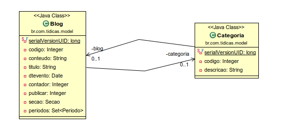
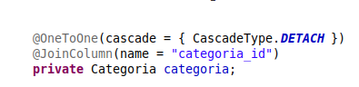
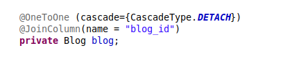
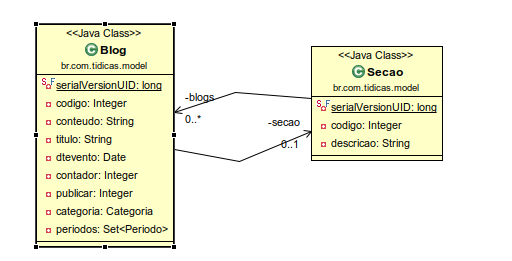
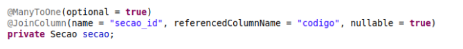
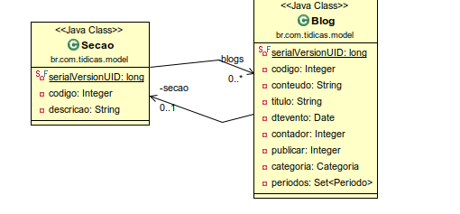
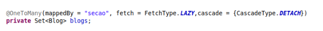
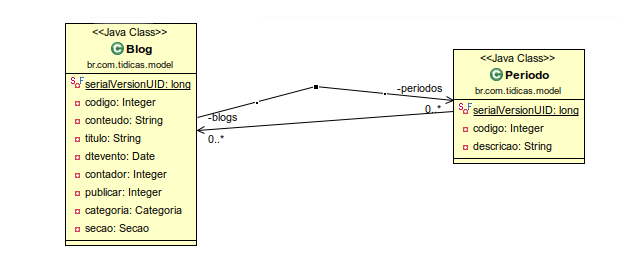
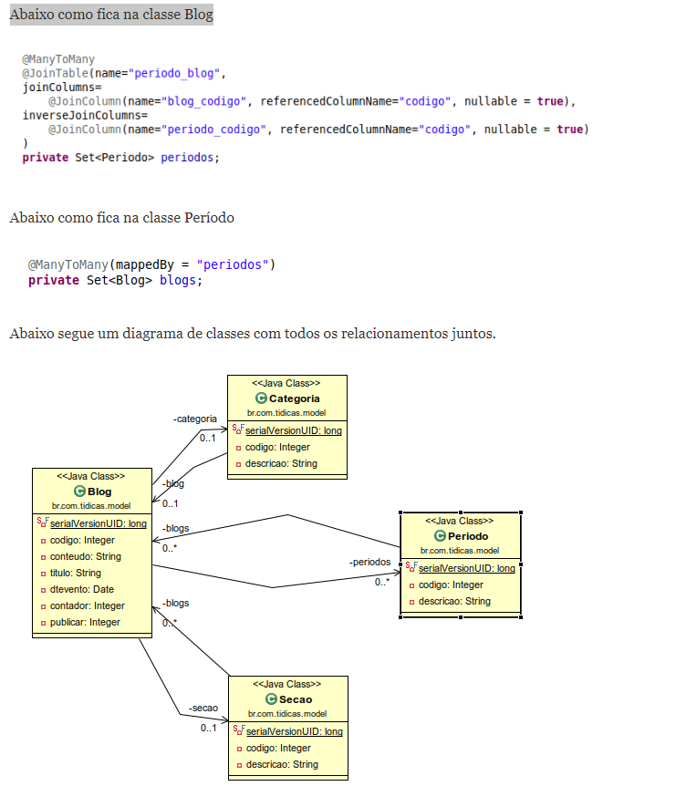

# Recursos-avancados

## Relembrando Relacionamentos

Na JPA os relacionamentos existentes são: OneToOne, ManyToOne, OneToMany, ManyToMany.

- Relacionamento @OneToOne

No relacionamento OneToOne, um item pode pertencer a apenas um outro item, é uma ligação um para um. Isso significa que cada linha de uma entidade se refere a apenas uma linha de outra entidade.
Vamos considerar o exemplo acima. Blog e Categoria de forma unidirecional reversa, a relação é uma relação OneToOne.
Isso significa que cada blog pertence a apenas uma categoria.

A anotação para mapear uma única entidade para uma única outra entidade é @OneToOne.

Abaixo como fica na classe Blog

Abaixo como fica na classe Categoria

Antes de se configurar o modelo citado no exemplo, temos de lembrar que um relacionamento tem um lado proprietário, de preferência o lado que manterá a chave estrangeira no banco de dados.

- Relacionamento @ManyToOne

Relação ManyToOne entre entidades: onde uma entidade é referenciada com outra entidade que contém valores únicos.
Em bancos de dados relacionais, esses relacionamentos são aplicáveis usando chave estrangeira/chave primária entre as tabelas.

Vamos considerar um exemplo de relação entre entidades de Blog e Seção.
De maneira unidirecional, ou seja, de blogs para seções, a relação muitos para um é aplicável.
Isso significa que cada registro de blog contém um código de seção, que deve ser uma chave primária na tabela seções.

A anotação para mapear esse tipo de relacionamento de muitas entidades de seção para uma única outra entidade blog é @ManyToOne.

- Relacionamento @OneToMany

Neste relacionamento, cada linha de uma entidade é referenciada a muitos registros filho em outra entidade.
O importante é que os registros de filhos não podem ter vários pais. Em uma relação OneToMany entre a Tabela A e a Tabela B, cada linha da Tabela A está ligada a 0, 1 ou muitas linhas da Tabela B.
Se o Blog e a Seção estiverem de maneira unidirecional reversa, a relação será uma relação OneToMany.
No nosso exemplo, seria um blog e suas seções. Um blog pode fazer parte de várias seções.

A anotação para mapear esse tipo de relacionamento de uma única entidade blog para muitas entidades de seção para é @OneToMany.

Abaixo como fica na classe Seção:

- Relacionamento @ManyToMany

O relacionamento muitos para muitos é onde uma ou mais linhas de uma entidade são associadas a mais de uma linha em outra entidade.
Vamos considerar um exemplo de relação entre as entidades Blog e Período. Na maneira bidirecional, tanto o blog quanto o período têm relação muitos para um. Isso significa que cada registro de Blog é referido por conjunto de Período (códigos de período), que devem ser chaves primárias na tabela Blog e armazenadas na tabela blog_periodo e vice-versa. Aqui, a tabela blog_periodo contém ambos os campos de chave estrangeira.

Os relacionamentos ManyToMany exigem um pouco mais de trabalho do que os outros relacionamentos.

Efetivamente, em um banco de dados, um relacionamento ManyToMany envolve uma tabela intermediária que faz referência a ambas as outras tabelas.

Portanto, para nosso exemplo, o relacionamento ManyToMany será aquele entre as instâncias Blog e Período, pois um blog ter vários períodos e um período pode ter participação de vários blogs.

A anotação para mapear esse tipo de relacionamento de muitas entidades blog para muitas entidades de período para é @ManyToMany.

##  Lazy loading e eager loading

Podemos definir a estratégia de carregamento de relacionamentos de entidades,
podendo ser lazy (tardia) ou eager (ansiosa).

Para exemplificar, criaremos as entidades Produto e Categoria, conforme os
códigos abaixo.

Categoria / Produto;

- Como você pode perceber, um produto tem uma categoria,

@Entity
@Table(name = "produto")
public class Produto {

    @Id
    @GeneratedValue(strategy = GenerationType.AUTO)
    private Long id;

    @Column(length =60, nullable = false)
    private String nome;

    @ManyToOne(optional = false)
    private Categoria categoria;

- e uma categoria pode  ter muitos produtos.

@Entity
@Table(name = "categoria")
public class Categoria {

    @Id
    @GeneratedValue(strategy = GenerationType.AUTO)
    private Long id;

    @Column(length = 60, nullable = false)
    private String nome;

    @OneToMany(mappedBy = "categoria")
    private List<Produto> produtos=new ArrayList<>();

    public Categoria(String nome, 

Referencias

- https://www.tidicas.com.br/?p=2058
- 